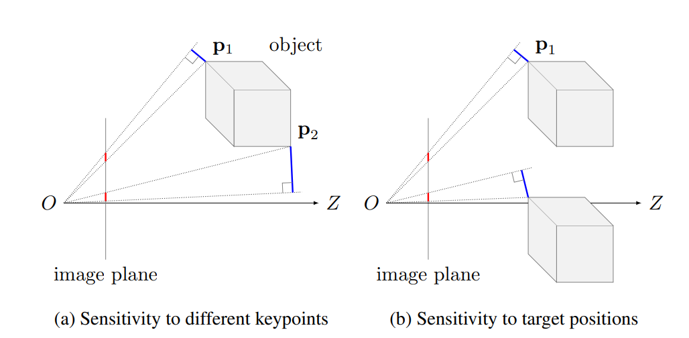

## Wide-Depth-Range-Pose (Modified Version)

This repository is based on [Wide-Depth-Range-Pose](https://github.com/cvlab-epfl/wide-depth-range-pose) by Yinlin Hu, Sébastien Speierer, Wenzel Jakob, Pascal Fua, and Mathieu Salzmann (CVPR 2021).
It has been **modified by Nithish** to work with custom datasets and adapted for specific use cases.

---

## Overview

The original work addresses 6D object pose estimation in space, where wide depth ranges and illumination challenges make conventional approaches less effective.
This repository builds on that foundation but includes modifications to support training and evaluation on non-SwissCube datasets.

<p align="center">
  
</p>

---

## Modifications in This Version

* Adapted data loading pipeline for custom dataset support
* Modified training configuration files
* Updated evaluation scripts for dataset compatibility
* Additional tweaks for performance improvements

---

## How to Use

Download your dataset and configure the dataset path in the corresponding YAML config file.
Run training via:

```bash
sh train.sh
```

Run testing via:

```bash
sh test.sh
```

---

## Citing

If you use this work in your research, please cite the **original paper**:

```
@inproceedings{hu2021wdrpose,
  title={Wide-Depth-Range 6D Object Pose Estimation in Space},
  author={Yinlin Hu and S\'ebastien Speierer and Wenzel Jakob and Pascal Fua and Mathieu Salzmann},
  booktitle={CVPR},
  year={2021}
}
```

---

## Notes

* This is a **modified version** of the original codebase. See [NOTICE](./NOTICE) for details.
* The original repo can be found at: [https://github.com/cvlab-epfl/wide-depth-range-pose](https://github.com/cvlab-epfl/wide-depth-range-pose)

---

# NOTICE

This product includes software developed at
Computer Vision Laboratory, EPFL
([https://github.com/cvlab-epfl/wide-depth-range-pose](https://github.com/cvlab-epfl/wide-depth-range-pose)).

---

Modifications by Nithish:

* Adapted data loading pipeline for custom dataset support
* Modified training configuration files
* Updated evaluation scripts for dataset compatibility
* Additional tweaks for performance improvements
